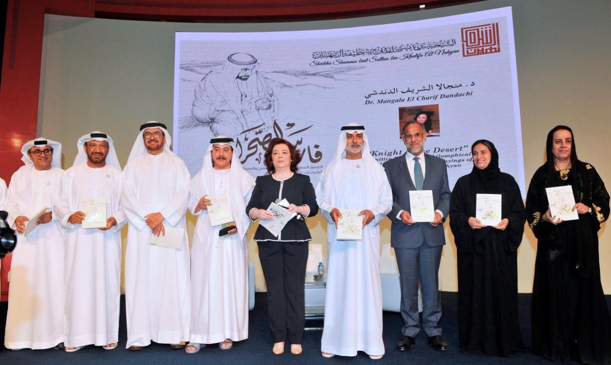
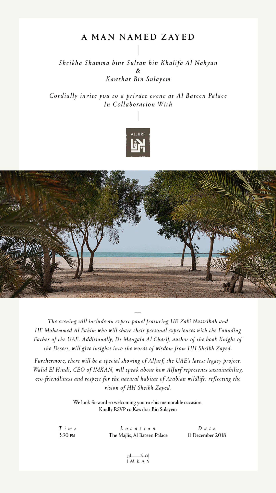

<video autoplay loop muted playsinline poster="resources/adbf.jpg" preload="auto">
    <source src="resources/events.webm" type="video/webm">
    <source src="resources/events.mp4" type="video/mp4">
    Your device doesn't support this video.
</video>

Launching of the Arabic version of the book « Knight of the desert » within the activities of the Abu Dhabi International Book Fair.

The launching ceremony was witnessed by His Excellency Sheikh Nahyan bin Mubarak Al Nahyan, Minister of Tolerance, Her Excellency Sheikha Lubna Al Qasimi, Sheikh Ahmed bin Sultan bin Saqr Al Qasimi, Sheikh Dhiab bin Khalifa bin Shakhbut Al Nahyan and His Excellency Nafdeeb Singh Suri, Ambassador of the Republic of India to the country.

{:.no_margins}

The ceremony was also attended by His Excellency Dr. Saeed Ahmed Ghobash, Supreme President of the Emirates University, His Excellency Mubarak Al Shamsi, Director General of the Abu Dhabi Center for Technical and Vocational Education and Training, Maitha Al Habsi, CEO of the Emirates Foundation, and Mohamed Salem Al Dhaheri, Advisor to the Head of the Education and Knowledge Department, and Dina Assaf, United Nations Coordinator, Dr. Sulaiman Al Hattlan, founder and CEO of Hatlan Media and a number of intellectuals, writers and thinkers.

{:.multicols.fullheight}

