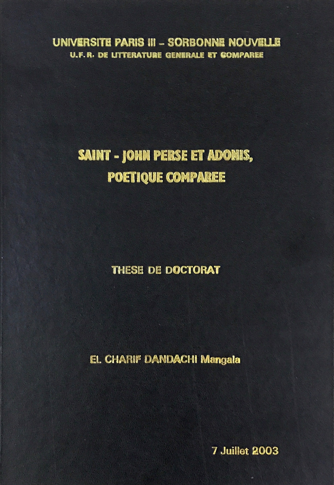

  
  

    <h1>PhD Thesis</h1>
    <h2>In French</h2>
    
Saint-John Perse and Adonis, Comparative Poetry.  &nbsp; - 2003, Sorbonne University Paris 3.

  

{:.hideOnMobile}
## PhD Thesis Portrayal

The translation by Adonis (Syrian Lebanese poet) of the work of Saint-John Perse (French poet) is what can be characterised as Adonis's turning stone. Open to the literature of the world and sensitive to its charm, the Arab writer followed the movement of modernity in the world and made his distinct contribution to poetry. He offers us a beautiful poetic work worthy of a comparative study with that of a great poet like Saint-John Perse.
  
The study of the prose offered to us by Saint-John Perse and Adonis allows us to identify the foundations of distinct poetic art. It also enables us to verify, on a poetic level, the theoretical conceptions of the work and thus conditions better evaluation of it. Both poets conceive poetry as an act of presence in the world, a mode of knowledge and a way of life. The poet is for them a man of action, he’s called to exert a perpetual effort and to cultivate a perfect clairvoyance. He poses as a creator in front of sensitive reality and seeks to challenge the norms and foundations of society. They both show ontological concerns and aim to recreate the world and men through the evocative power of language that has become a poetic power of creation.
  
Despite the resemblance between the conceptions of our two poets, the cultural space that serves as a background for their experiences allows them to keep their distance from each other. Heir to a wide and diverse cultural background, Saint-John Perse collects an inexhaustible richness that harmonizes with the contradictory tendencies of universal thought and enfuses his writing a specific signature. Sensitive to the poetic conception that presides over the work of Saint-John Perse, Adonis remains an heir to the Eastern mysticism and the flame that fueled ancient Arab poetry. His writing is an arabesque born of the weaving between the Arab heritage and Western modern poetry, in this margin he succeeds in capturing the seeds of renewal. Despite the refusal that animates his work and the hostility towards the past, the Adonisian poetry turns out to be well anchored in its Arabic framework that the poet works to energize. It is this dimension that allows Adonis to maintain his great distances from the French poet despite their resemblances.

  
  

    <h1>Master's Thesis</h1>
    <h2>In French</h2>
    
The revolution in the poetic work of Saint-John Perse.  &nbsp; - 1998, Balamand University.

  

{:.hideOnMobile}
## Master's Thesis Portrayal

Saint-John Perse (31 May 1887 – 20 September 1975) was a French poet and diplomat, awarded the Nobel Prize in Literature in 1960. The thesis is a study of the following works: "Exil" (1942), "Pluies" (1943), "Poème à l'étrangère" (1943), "Neiges" (1944) and "Vents" (1946). It analyses the evocative mysterious imagery of Saint-John Perse’s poetry and shows how the four elements (water, earth, wind and fire) rule over his poetic world, emphasizing that the only way to achieve true purity is through genesis.
